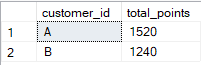

<h2>Solution to Question 10</h2>
<font size = "+1.5">In the first week after a customer joins the program (including their join date) they earn 2x points on all items, not just sushi - how many points do customer A and B have at the end of January?</font>

````sql
select members.customer_id,
	sum(	
		case
				when menu.product_name in ('curry', 'ramen', 'sushi') and  datediff(day, members.join_date, sales.order_date) <= 7 then (menu.price * 10) * 2
				when menu.product_name in ('ramen', 'curry') then menu.price * 10
				when menu.product_name = 'sushi' then (menu.price * 10) * 2
				end
		  ) as total_points
from sales
inner join menu on sales.product_id = menu.product_id
inner join members on sales.customer_id = members.customer_id
where month(sales.order_date) = 1 and day(sales.order_date) <= 31
group by members.customer_id;
````
