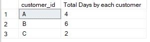

<h2>Solution to Question 2</h2>
<font size = "+1.5">How many days has each customer visited the restaurant?</font>

```sql
select customer_id, count(distinct(order_date)) as "Total Days by each customer"
from sales
group by customer_id
```


