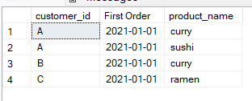

<h2>Question 3 Solution</h2>
<font size = "+1.5">What was the first item from the menu purchased by each customer?</font>

````sql
select customer_id, "First Order", product_name 
from (
		select customer_id, 
		min(order_date) as "First Order",
		product_name,
		rank() over (partition by customer_id order by order_date) as "Product Rank"
		from sales
		inner join menu on sales.product_id = menu.product_id
		GROUP BY customer_id, product_name, order_date
	) as Subquery
where "Product Rank" = 1
````

