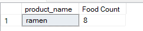

<h2>Solution to Question 4</h2>
<font size = "+1.5">What is the most purchased item on the menu and how many times was it purchased by all customers?</font>

```sql
select  top 1 product_name, count(sales.product_id) as 'Food Count'
from menu
inner join sales on menu.product_id = sales.product_id
group by product_name
order by 'Food Count' desc
```


