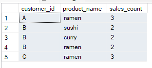

<h2> Solution to Question 5</h2>
<font size = "+1.5">Which item was the most popular for each customer?</font>

```sql
with max_bought as (
		select sales.customer_id,
		count(sales.product_id) as sales_count,
		menu.product_name,
		dense_rank() over (partition by sales.customer_id order by count(sales.product_id) desc) as rank
		from sales
		inner join menu on sales.product_id = menu.product_id
		group by sales.customer_id, menu.product_name
)

select customer_id, product_name, sales_count
from max_bought
where rank = 1
```


