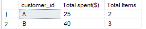

<h2>Solution to Question 8</h2>
<font size = "+1.5">What is the total items and amount spent for each member before they became a member?</font>


````sql 
select  members.customer_id, 
		sum(menu.price) as "Total spent($)",
		count(sales.product_id) as  "Total Items"
	from sales
	inner join menu on sales.product_id = menu.product_id
	inner join members on sales.customer_id = members.customer_id
	where sales.order_date < members.join_date 
	group by members.customer_id
````

