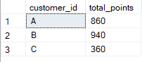

<h2>Solution to Question 9</h2>
<font size = "+1.5">If each $1 spent equates to 10 points and sushi has a 2x points multiplier - how many points would each customer have?</font>

````sql
    select customer_id,
	sum(	
		case
				when menu.product_name = 'curry' then menu.price * 10
				when menu.product_name = 'ramen' then menu.price * 10
				when menu.product_name = 'sushi' then (menu.price * 10) * 2
				end
		  ) as total_points
from sales
inner join menu on sales.product_id = menu.product_id
group by customer_id;
````

